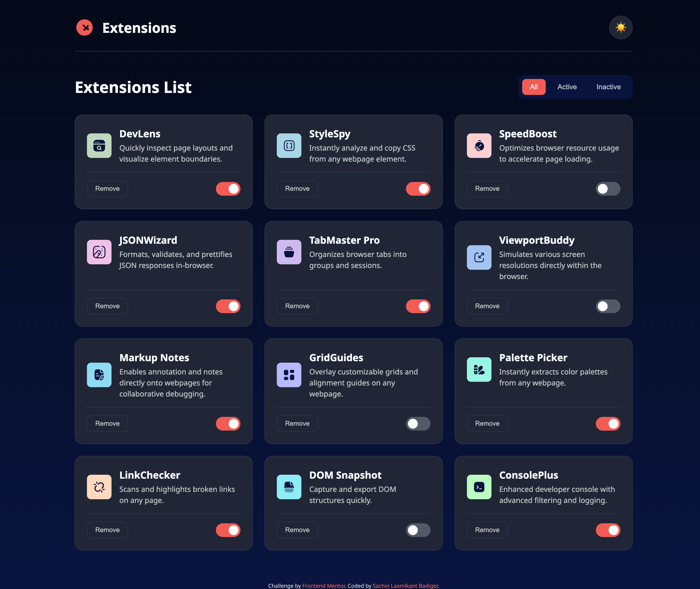

# Frontend Mentor - Browser extensions manager UI

This is a solution to the [Browser extensions manager UI challenge on Frontend Mentor](https://www.frontendmentor.io/challenges/browser-extensions-manager-ui-VXJp9D7t9W). Frontend Mentor challenges help you improve your coding skills by building realistic projects.

## Table of Contents

- [Overview](#overview)
  - [The Challenge](#the-challenge)
  - [Screenshot](#screenshot)
  - [Links](#links)
- [My Process](#my-process)
  - [Built With](#built-with)
  - [What I Learned](#what-i-learned)
  - [Continued Development](#continued-development)
- [Author](#author)

## Overview

### The Challenge

Users should be able to:

- Toggle extensions between active and inactive states.
- Filter extensions based on their active/inactive status.
- Remove extensions from the list.
- Select their color theme (light/dark mode).
- View the optimal layout for the interface depending on their device's screen size.
- See hover and focus states for all interactive elements on the page.

### Screenshot



### Links

- **Solution URL:** [GitHub Repository](https://github.com/SachinLaxmikantBadiger/browser-extensions-manager)
- **Live Site URL:** [Live Site on Vercel](https://browser-extensions-manager-sachinlaxmikantbadigers-projects.vercel.app/)

## My Process

### Built With

- Semantic HTML5 markup
- CSS Custom Properties for theming
- Flexbox & CSS Grid for layout
- Mobile-first workflow
- Vanilla JavaScript for all interactivity

### What I Learned

This project was a fantastic exercise in DOM manipulation and state management with vanilla JavaScript.

A key part of the project was dynamically rendering the UI by fetching data from a local `data.json` file. I learned how to use the `fetch` API to get the data and then loop through it to create and append HTML elements to the grid.

```js
const initializeApp = async () => {
    const response = await fetch('data.json');
    const data = await response.json();
    extensions = data.map(ext => ({ ...ext, active: ext.isActive }));
    renderExtensions();
};